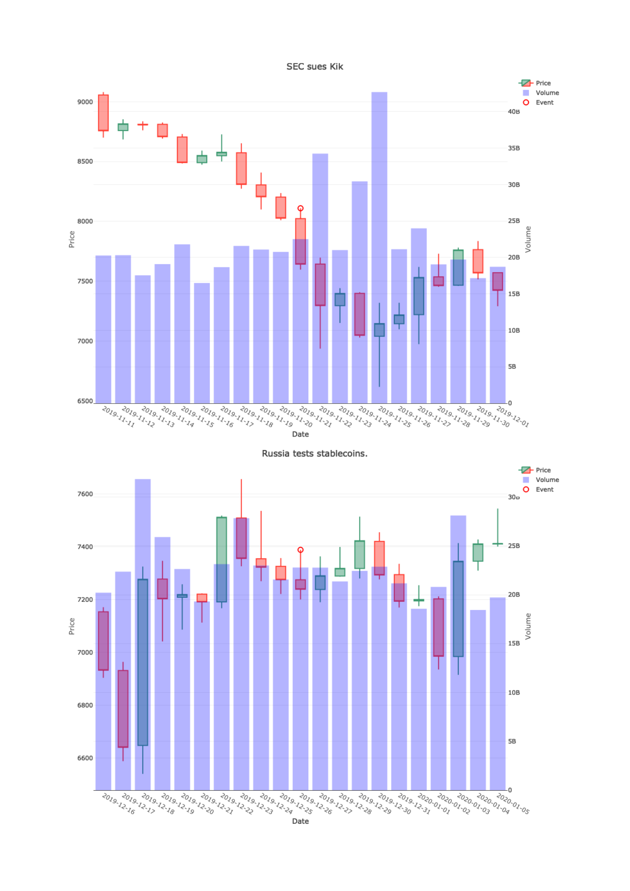
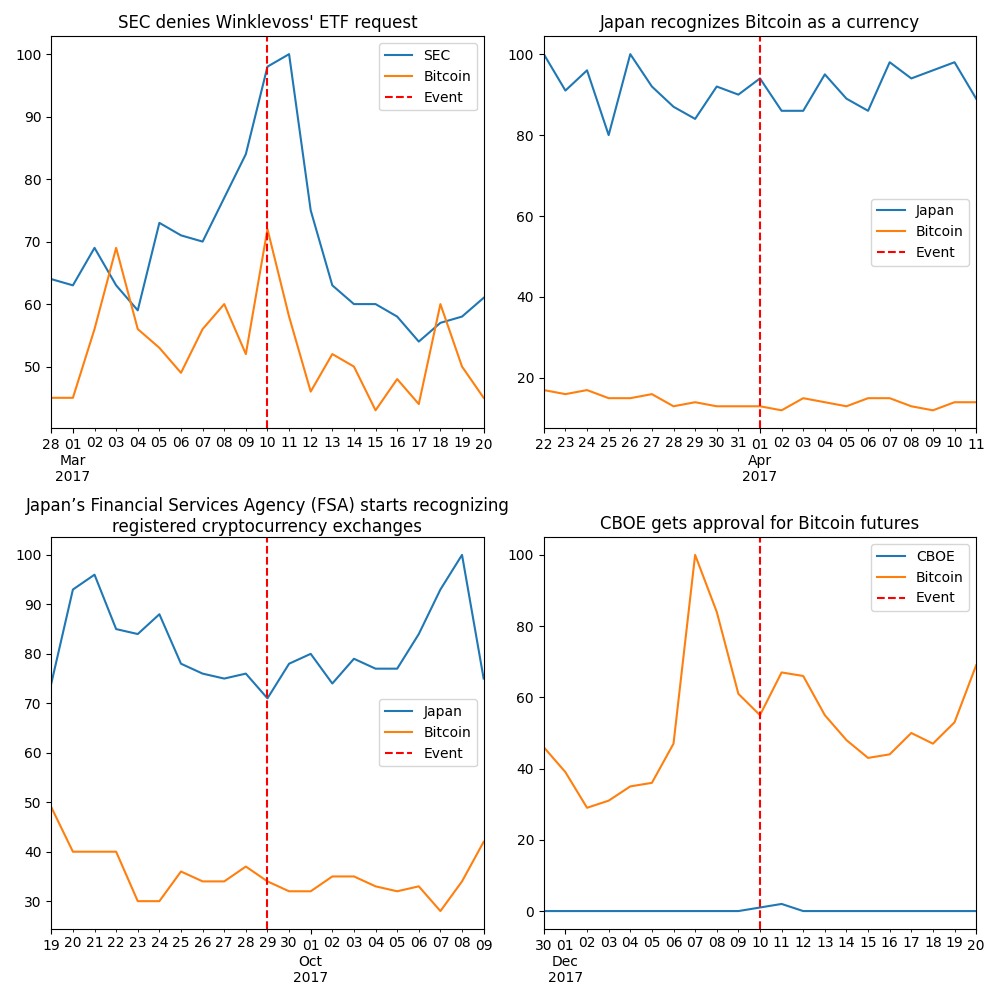
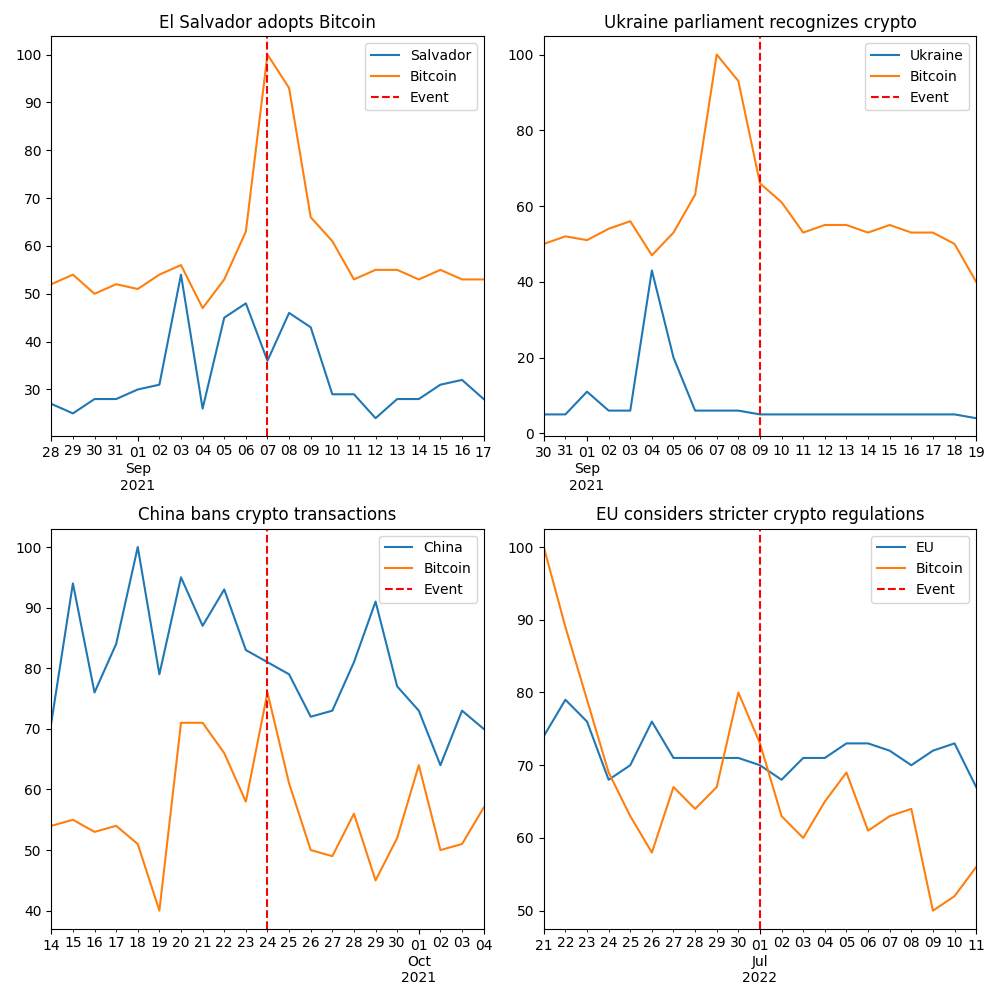

```{r setup, include=FALSE}
knitr::opts_chunk$set(echo = TRUE)
```

<div align="center">


</div>

&nbsp;

# Analyzing the Impact of Regulatory Announcements on Bitcoin Price
this Case Study is the finishing lesson that will lend me to obtain the Google
Data Analyst Professional Certificate. Instead of choosing a pre-made Case Study, i prefered to oriented my analyses in a field that deeply concerned me. So i choosed this subject.

In order to have a concrete plan about the analyse, it will follow five of the six Steps Rule of Data Analyse since the sharing step is shown thrown the Analyse step : 

* Ask
* Prepare or Collect
* Clean and Process
* Analyse
* Act

You will have the opportunity to navigate throw this document using the section button related at each of these steps. 

### Background (ASK):
Cryptocurrencies are known for their price volatility. One significant factor affecting cryptocurrency prices is the regulatory environment. Announcements of regulations, whether positive or negative, can lead to significant price swings. Understanding the relationship between regulatory announcements and cryptocurrency prices could provide insights for investors, policymakers, and the broader financial community.

#### Data Requirements:
Historical data price for Bitcoin
Dates and details of key regulatory announcements concerning cryptocurrencies.
Trading volume data for Bitcoin.
Possibly, data on social media sentiment or news coverage around the time of regulatory announcements. (Google trend)

#### Methodology:

Time-series analysis to track price movements and volatility over time.
Event study methodology to analyze abnormal returns around the time of regulatory announcements.
Cross-sectional analysis to compare impacts across different google researchs.

#### Expected Outcome:

A comprehensive understanding of how regulatory announcements affect cryptocurrency prices and the broader crypto market dynamics.
Insights into the level of sensitivity of cryptocurrency prices to regulatory news, which could inform investment strategies and policy discussions.

This problem statement aims to delve into the interaction between regulatory developments and cryptocurrency market behavior, which is a highly relevant and evolving area of study within the crypto space.


### Objectives:

#### Identify Key Regulatory Announcements: (Prepare or Collect) [Go to Section 1](#section1)
Compile a list of significant regulatory announcements concerning Bitcoin over a defined period. 
Collect the Bitcoin price history using the OHLC method and Volume. 


#### Ensuring legitiy of Data : (Clean and Process) [Go to Section 2](#section2)
Ensure that the data collected is not biased and only the relevant data are used.


#### Price Analysis: (Analyse) [Go to Section 3](#section3)
Analyze the price movements of Bitcoin around the time of these announcements : 


#### Volatility Analysis: (Analyse) [Go to Section 4](#section4)
Examine the volatility in Bitcoin prices before, during, and after key regulatory announcements :


#### Sectoral Impact: (Analyse) [Go to Section 5](#section5)
Evaluate the impact of regulatory announcements by google trends


#### Conclusion : (Act) [Go to Section 6](#section6)
Personal thought about the analyses and future expections

<div align="center">


</div>

&nbsp;

 <a id="section1"></a>

## Prepare or Collect 
It is now time for us to start collecting our data and ensure that they are safe, open-sources and not biased. 
In order to do this, with the help of chat GPT from OpenAI, I've referenced 36 majors events that occurs in the crypto sphere since 2013. Every events have been verified and are mainly focus on International Organizations, Regulatory and Law. So every aspect influences from privates company haven't been included. The list have been stocked in a Spreadsheet named "events".

Here's a list of the majors events that happens : 

* 14.04.14	IRS issues guidelines on cryptocurrency taxation.
* 17.07.14	New York introduces BitLicense.
* 10.03.17	SEC denies Winklevoss' ETF request.
* 01.04.17  Japan recognizes Bitcoin as a currency.
* 29.09.17	Japan’s Financial Services Agency recognizing registered cryptocurrency exchanges.
* 10.12.17	CBOE get approval for Bitcoin futures.
* 11.12.17	SEC's Jay Clayton states Bitcoin isn't a financial security.
* 17.12.17	CME get approval for Bitcoin futures.
* 20.02.18	Germany’s financial regulator, BaFin, provides guidance on ICOs.
* 05.04.18	India's Reserve Bank prohibits banks from serving crypto businesses.
* 03.04.19	SEC publishes framework for ICOs.
* 09.05.19	IRS and FinCEN release cryptocurrency guidelines.
* 25.06.19	CFTC approves Ledger X
* 02.07.19	SEC considers running Bitcoin nodes
* 23.09.19	ICE launches physically-backed Bitcoin futures platform, Bakkt.
* 09.10.19	SEC denies Bitwise's Bitcoin ETF proposal.
* 19.11.19	Fidelity licensed for Bitcoin in New York
* 20.11.19	U.S. Federal Reserve explores digital dollar.
* 21.11.19	SEC sues Kik
* 26.12.19	Russia tests stablecoins.
* 01.01.20	EU's 5AMLD brings crypto exchanges under AML legislation.
* 12.03.20	The Bank of England releases a discussion paper on Central Bank Digital Currency.
* 10.07.20	EU's 6AMLD is implemented.
* 12.10.20	The European Central Bank (ECB) accelerates work on a digital euro.
* 19.04.21	UK explores digital currency
* 27.08.21	U.S. Federal Reserve issues fintech guidelines.
* 07.09.21	El Salvador adopts Bitcoin.
* 09.09.21	Ukraine parliament recognizes crypto
* 24.09.21	China bans crypto transactions
* 01.07.22	EU considers stricter crypto regulations.
* 01.12.22	Gary Gensler requests increased crypto regulation.
* 24.01.23	U.S. Senate Banking Committee discusses digital dollar.
* 18.09.23	South Korea emphasizes OTC regulations after illegal deals.

You'll find all the sources at the end of the document [Go to Section 7](#section7)

#### Data Collecting - Bitcoin Price History
To complete this task, i choose to use the data from Yahoo Finance and then decided to import it throw Python in order to show as much skills as possible. OHLC mean "Open, High, Low, Close". We've also got the volume and the date for data line. 

##### Click here to see original path file from where it could be download. -> [here](https://finance.yahoo.com/quote/BTC-USD/history?p=BTC-USD)

#### Here's the code that i wrote to download OHLC Data in Python : 

```{python}
import yfinance as yf
import csv

def fetch_ohlc_data(symbol="BTC-USD"):
    # Download the OHLC data using yfinance
    data = yf.download(symbol, start="2009-01-01")  # Bitcoin as been founded in 2009
    return data

def save_to_csv(data, filename="bitcoin_ohlc.csv"):
    if data.empty:
        print("No Data to Save.")
        return

    # Save the data into csv file
    data.to_csv(filename)

if __name__ == "__main__":
    data = fetch_ohlc_data()
    save_to_csv(data)
```

<a id="section2"></a>

## Clean and Process

### Cleaning Data - Spreadsheet / Excel
Since all the data have been imported, it's time to clean ! 

I didn't put inside this documents the cleaning process used in Spreadsheet but in overall here are the mains steps :

Firstable, i opened the CSV.file downloaded from Python with Excel, Convert the string data type in the Date Column into Date type, checked the whole documents, everythings fine. Saved.

Secondly,the "Events" file, i used Excel Spreadsheet and then used the "Text to Columns" function in the Data section in order to split the columns for each Dates and Events using the ":" delimiter. Sorted the Date Column ASC. Saved. 

Now that our two spreadsheets have been cleaned, they are ready to merge. in order to complete this task, i'll using SQL to make the task a little bit trickier. Even if we don't have more than 1'000'000 rows, it's part of the exercise. 

**Below you will find a capture of the bitcoin_ohlc file with the head function**

```{r, include=FALSE}
install.packages("tidyverse", repos = "https://cran.rstudio.com/")
library(tidyverse)
```

```{r}
CaseStudy <- read_csv("bitcoin_ohlc.csv", show_col_types = FALSE)
head(CaseStudy)
```


### Cleaning Data - SQL
Since we have two larges data set and we wants to merge them in order to link the Events that we listed with the chart of the BTC price. In order to do this, we are going to use SQL because i've been learning this new language during my Certificate Google Course. 
Here are the mains steps : 

#Preparing the file for the main chart
```sql

#Checking the data table "ohlc". Everything's fine !
SELECT *
FROM `ohlc`
LIMIT 100;

#Checking the data table "bitcoin_event" and finding that the Data type for the Date Column isn't correct. it should be Date instead of String
SELECT * 
FROM `bitcoin.event`
LIMIT 100;

#Modifying the Data type
CREATE OR REPLACE TABLE `bitcoin.event`
AS
SELECT 
  PARSE_DATE('%d.%m.%y', string_field_0) as Date,
  string_field_1 as Event
FROM `bitcoin.event`;

#Merging the two tables since they have all been cleaned et checked 
CREATE OR REPLACE TABLE `bitcoin.merged_table`
AS
SELECT ohlc.*, event.Event
FROM `bitcoin.ohlc` as ohlc
LEFT JOIN `bitcoin.event` as event
ON ohlc.Date = event.Date;

#Checking if the merge is a succeed and Ordering by Date the new table
SELECT * 
FROM `bitcoin.merged_table`
WHERE Event IS NOT NULL
ORDER BY Date ASC;
```

Preparing the file focus on the events. Each Events has a window of 10 days before and 10 days after the event.

```sql

WITH EventDates AS (
  SELECT DISTINCT Date AS EventDate
  FROM `case-study-bitcoin.bitcoin.merged_table`
  WHERE Event IS NOT NULL
)

SELECT DISTINCT m.*
FROM `case-study-bitcoin.bitcoin.merged_table` m
JOIN EventDates e
ON m.Date BETWEEN DATE_SUB(e.EventDate, INTERVAL 10 DAY) AND DATE_ADD(e.EventDate, INTERVAL 10 DAY)
ORDER BY m.Date;
```

Once those steps had been conclude, we can download the results of the queries from BigQuery and stores them inside the folder of the project. 

Events <a id="section3"></a>
**Analyse**

**Preparation of the R Environnement**


**Installing of the packages**

```markdown
```{r, echo=TRUE, message=FALSE, warning=FALSE, results='hide'}
install.packages("ggplot2", repos = "https://cran.rstudio.com/")
install.packages("dplyr", repos = "https://cran.rstudio.com/")
install.packages("reticulate", repos = "https://cran.rstudio.com/")
install.packages("plotly", repos = "https://cran.rstudio.com/")
install.packages("tidyquant", repos = "https://cran.rstudio.com/")
install.packages("IRdisplay", repos = "https://cran.rstudio.com/")
install.packages("knitr", repos = "https://cran.rstudio.com/")
```

**Running the library**

```markdown
```{r, echo=TRUE, message=FALSE, warning=FALSE, results='hide'}
library(ggplot2)
library(dplyr)
library(reticulate)
library(plotly)
library(tidyquant)
library(lubridate)
library(IRdisplay)
library(knitr)
library(purrr)
```


**Importing the data from the CSV file**
```{r}
## Importind the data file bitcoin_ohlc.csv
CaseStudy <- read_csv("bitcoin_ohlc.csv")
```


**Now it's time to have a look at the data, since it has already been cleaned we want to visualize it throw chart.** 

```{r, warning=FALSE, fig.width=10}
# Candlestick Chart
fig <- plot_ly(data = CaseStudy, type = "candlestick",
               x = ~Date,
               open = ~Open,
               high = ~High,
               low = ~Low,
               close = ~Close) %>%
  layout(title = "BTC Prices and Volumes")

#Adding Volumes and transparancy bars
fig <- fig %>% 
  add_bars(x = ~Date, y = ~Volume, yaxis = "y2", opacity = 0.3, name = "Volume", marker = list(color = "blue"))

#Adding the Graphic layout
fig <- fig %>% 
  layout(yaxis2 = list(overlaying = "y", side = "right", title = "Volume"))

# Show the Graphic
fig
```


### Let's Match ! 
**Currently we have a chart of Bitcoin price and volume variation, the idea is to use the new document in order to see if there is any correlation between high price movement or volume spike and the events reported.**

```{r, warning=FALSE, fig.width=10}
CaseStudy <- read.csv("merged_tables.csv")

# Candlestick chart
fig <- plot_ly(data = CaseStudy, type = "candlestick",
               x = ~Date,
               open = ~Open,
               high = ~High,
               low = ~Low,
               close = ~Close) %>%
  layout(title = "BTC Prices with Events")

# Adding volumes
fig <- fig %>% 
  add_bars(x = ~Date, y = ~Volume, yaxis = "y2", opacity = 0.3, name = "Volume", marker = list(color = "blue"))

# Filter to get only the rows with non-null events
events_data <- CaseStudy[!is.na(CaseStudy$Event) & CaseStudy$Event != "",]

# Adding markers for events
fig <- fig %>% 
  add_markers(data = events_data, x = ~Date, y = ~High, hovertext = ~Event, hoverinfo = "text", marker = list(color = "blue", size = 5))

# Adding shapes for lines
shapes <- lapply(1:nrow(events_data), function(i){
  list(
    type = "line",
    x0 = events_data$Date[i],
    y0 = events_data$High[i],
    x1 = events_data$Date[i],
    y1 = max(CaseStudy$High, na.rm = TRUE),
    line = list(color = "blue", width = 0.6, opacity = 0.6)
  )
})

# Updating layout for volumes and shapes
fig <- fig %>% 
  layout(yaxis2 = list(overlaying = "y", side = "right", title = "Volume"),
         shapes = shapes)

# Displaying the chart
fig
```

 <a id="section1"></a>

**Detailled Charts Scope for each Event**
Notice that with this process we only get big picture screen of the correlation between volatility and events. Let's have a look at a smaller scale. Below you will find each events in a window of 20 days, 10 before and 10 after the event. 

```{r, warning=FALSE, fig.width=10, message=FALSE, echo=TRUE}

CaseStudy <- read.csv("events_filtered.csv")

plot_single_event <- function(event_name, full_data) {
  event_date <- as.Date(full_data$Date[full_data$Event == event_name][1])
  subset_data <- full_data[full_data$Date %in% seq.Date(from = event_date - days(10), to = event_date + days(10), by = "days"), ]
  
  fig <- plot_ly(data = subset_data, type = "candlestick",
                 x = ~Date, open = ~Open, high = ~High, low = ~Low, close = ~Close) %>%
    layout(title = event_name)
  
  # Adding the volumes
  fig <- fig %>% 
    add_bars(x = ~Date, y = ~Volume, yaxis = "y2", opacity = 0.3, name = "Volume", marker = list(color = "blue")) %>%
    layout(yaxis2 = list(overlaying = "y", side = "right"))
  
  # Adding the Event Marker
  fig <- fig %>% 
    add_markers(data = subset_data[subset_data$Event == event_name,], x = ~Date, y = ~High, text = ~Event, 
                marker = list(symbol = "circle-open", size = 10, color = "red", line = list(color = "red", width = 2)))
  
  print(fig)
}

unique_events <- unique(CaseStudy$Event)
unique_events <- unique_events[!is.na(unique_events) & unique_events != ""]

for(event in unique_events) {
  plot_single_event(event, CaseStudy)
}
```
**In order to facilitate the presentations of the charts, they have been converted into png file and the arrangement have been made on Canva. Here's the chunk code of for the Conversion :** 

```{r, warning=FALSE, message=FALSE, eval=FALSE}
# Code to generate graphs and save them as images
webshot::install_phantomjs()

# Reading the data
CaseStudy <- read.csv("events_filtered.csv")

# Defining the function to generate a single graph
plot_single_event <- function(event_name, full_data) {
  event_date <- as.Date(full_data$Date[full_data$Event == event_name][1])
  subset_data <- full_data[full_data$Date %in% seq.Date(from = event_date - days(10), to = event_date + days(10), by = "days"), ]
  
  fig <- plot_ly(data = subset_data, type = "candlestick",
                 x = ~Date, open = ~Open, high = ~High, low = ~Low, close = ~Close, name = "Price") 
  
  # Adding volumes
  fig <- fig %>% 
    add_bars(x = ~Date, y = ~Volume, yaxis = "y2", opacity = 0.3, name = "Volume", marker = list(color = "blue"))
  
  # Adding the marker for the event
  fig <- fig %>% 
    add_markers(data = subset_data[subset_data$Event == event_name,], x = ~Date, y = ~High, text = ~Event, 
                marker = list(symbol = "circle-open", size = 10, color = "red", line = list(color = "red", width = 2)), 
                name = "Event")
  
  # Updating axes and removing the range slider
  fig <- fig %>% 
    layout(
      title = event_name, 
      xaxis = list(rangeslider = list(visible = FALSE)),
      yaxis2 = list(overlaying = "y", side = "right", title = "Volume"),
      yaxis = list(title = "Price")
    )
  
  return(fig)
}

# Getting unique events
unique_events <- unique(CaseStudy$Event)
unique_events <- unique_events[!is.na(unique_events) & unique_events != ""]

# Loop to generate and save a graph for each unique event
for(i in seq_along(unique_events)) {
  event <- unique_events[i]
  fig <- plot_single_event(event, CaseStudy)
  file_path <- file.path("/Users/loichanggeli/BTC_CASE_STUDY", paste0("event_", i, ".png"))
  export(fig, file = file_path)
}
```





<a id="section5"></a>
**Interest by region**
We are going now to look up for google trend for the Bitcoin during the Timeframe of each event and see if we can identify any paterns about those requests : 

In order to start the process, i decided to select a key word for each Event and then link it with the Bitcoin term on Google Trend. the time frame selected is the same for the charts shown before. The aim of this study is to see if there's any coorelation between Google trend and the Event. 

**Here's the Python Script**

```{python}
from pytrends.request import TrendReq
import matplotlib.pyplot as plt
import math
import pandas as pd

pytrends = TrendReq(hl='en-US', tz=360)

events = [
    "SEC", "Japan", "Japan", "CBOE", "SEC", "CME", "Bafin", "India",
    "SEC", "IRS", "CFTC", "SEC", "ICE", "SEC", "Fidelity", "US FED",
    "SEC", "Russia", "AML", "Bank of England", "AMLD", "ECB",
    "UK", "US FED", "Salvador", "Ukraine", "China", "EU",
    "SEC", "US Senate", "South Korea"
]

timeframes = [
    '2017-02-28 2017-03-20', '2017-03-22 2017-04-11', '2017-09-19 2017-10-09',
    '2017-11-30 2017-12-20', '2017-12-01 2017-12-21', '2017-12-07 2017-12-27',
    '2018-02-10 2018-03-02', '2018-03-26 2018-04-15', '2019-03-24 2019-04-13',
    '2019-04-29 2019-05-19', '2019-06-15 2019-07-05', '2019-06-22 2019-07-12',
    '2019-09-13 2019-10-03', '2019-09-29 2019-10-19', '2019-11-09 2019-11-29',
    '2019-11-10 2019-11-30', '2019-11-11 2019-12-01', '2019-12-16 2020-01-05',
    '2019-12-22 2020-01-11', '2020-03-02 2020-03-22', '2020-06-30 2020-07-20',
    '2020-10-02 2020-10-22', '2021-04-09 2021-04-29', '2021-08-17 2021-09-06',
    '2021-08-28 2021-09-17', '2021-08-30 2021-09-19', '2021-09-14 2021-10-04',
    '2022-06-21 2022-07-11', '2022-11-21 2022-12-11', '2023-01-14 2023-02-03',
    '2023-09-08 2023-09-28'
]

full_event_descriptions = [
    "SEC denies Winklevoss' ETF request",
    "Japan recognizes Bitcoin as a currency",
    "Japan’s Financial Services Agency (FSA) starts recognizing registered cryptocurrency exchanges",
    "CBOE gets approval for Bitcoin futures",
    "SEC's Jay Clayton states Bitcoin isn't a financial security",
    "CME gets approval for Bitcoin futures",
    "Germany’s financial regulator, BaFin, provides guidance on ICOs",
    "India's Reserve Bank prohibits banks from serving crypto businesses",
    "SEC publishes framework for ICOs",
    "IRS and FinCEN release cryptocurrency guidelines",
    "CFTC approves Ledger X",
    "SEC considers running Bitcoin nodes",
    "ICE launches physically-backed Bitcoin futures platform, Bakkt",
    "SEC denies Bitwise's Bitcoin ETF proposal",
    "Fidelity licensed for Bitcoin in New York",
    "U.S. Federal Reserve explores digital dollar",
    "SEC sues Kik",
    "Russia tests stablecoins",
    "EU's 5AMLD brings crypto exchanges under AML legislation",
    "The Bank of England releases a discussion paper on Central Bank Digital Currency",
    "EU's 6AMLD is implemented",
    "The European Central Bank (ECB) accelerates work on a digital euro",
    "UK explores digital currency",
    "U.S. Federal Reserve issues fintech guidelines",
    "El Salvador adopts Bitcoin",
    "Ukraine parliament recognizes crypto",
    "China bans crypto transactions",
    "EU considers stricter crypto regulations",
    "Gary Gensler requests increased crypto regulation",
    "U.S. Senate Banking Committee discusses digital dollar",
    "South Korea emphasizes OTC regulations after illegal deals"
]

# Calculate the number of necessary files
num_files = math.ceil(len(events) / 4)

for file_num in range(num_files):
    # Create a figure with 2 rows and 2 columns for each file
    fig, axs = plt.subplots(2, 2, figsize=(10, 10))
    
    for i in range(4):
        event_idx = file_num * 4 + i
        if event_idx >= len(events):
            break  # Exit the loop if we have processed all the events
        
        event = events[event_idx]
        timeframe = timeframes[event_idx]
        
        # Build the payload
        pytrends.build_payload(kw_list=[event, 'Bitcoin'], timeframe=timeframe)
        
        # Get interest over time
        interest_over_time_df = pytrends.interest_over_time()
        
        # Find the index of the row and column for the current subplot
        row_idx = i // 2
        col_idx = i % 2
        
        # Plot
        ax = axs[row_idx, col_idx]
        interest_over_time_df.plot(ax=ax)
        ax.set_title(full_event_descriptions[event_idx], wrap=True)
        ax.set_xlabel('')
        
        # Calculate the event date
        event_date = pd.to_datetime(timeframes[event_idx].split()[0]) + pd.Timedelta(days=10)
        
        # Add a vertical line to indicate the event day
        ax.axvline(x=event_date, color='red', linestyle='--', label='Event')
        ax.legend()

    # Save the figure in a file
    fig.tight_layout()
    fig.savefig(f'plot_{file_num + 1}.png')
    plt.close(fig)  # Close the figure to free up memory
```

**Here are the charts**







**In order to get as many informations as possible, i looked up about interest for the Bitcoin's term on google trend. If you want to have a look at the original Website, click [here](https://trends.google.com/trends/explore?date=all&q=%2Fm%2F05p0rrx&hl=en-GB)**

See in which location your term was most popular during the specified time frame. Values are calculated on a scale from 0 to 100, where 100 is the location with the most popularity as a fraction of total searches in that location, a value of 50 indicates a location which is half as popular. A value of 0 indicates a location where there was not enough data for this term.
Note: A higher value means a higher proportion of all queries, not a higher absolute query count. So a tiny country where 80% of the queries are for 'bananas' will get twice the score of a giant country where only 40% of the queries are for 'bananas'.

```{r, warning=FALSE, fig.width=10}
# Initialization of the World Map Google trend for Bitcoin
CaseStudy <- read.csv("map_interest.csv")

# Get the data of the world map
world_map <- map_data("world")

# Join your data with the geographic data set
merged_data <- world_map %>%
  left_join(CaseStudy, by = c("region" = "country")) 

# Identify the top 5 countries based on the metric
top5_countries <- CaseStudy %>%
  top_n(5, metric)

# Calculate the central coordinates of each country to place the labels
country_centers <- merged_data %>%
  group_by(region) %>%
  summarise(avg_long = mean(long, na.rm = TRUE), avg_lat = mean(lat, na.rm = TRUE), .groups = 'drop')

top5_centers <- country_centers %>%
  filter(region %in% top5_countries$country)

# Create the choropleth map with ggplot2
p <- ggplot(data = merged_data, aes(x = long, y = lat)) +
  geom_polygon(aes(fill = metric, group = group)) +
  scale_fill_gradientn(colours = colorRampPalette(c("blue", "green", "yellow", "red"))(25),
                       name = "Bitcoin Interest") +
  theme_minimal() +
  theme(legend.position = "bottom",
        legend.title = element_text(size = 12),
        legend.text = element_text(size = 10))

# Define the positions where you want the country names to appear
x_positions <- rep(min(merged_data$long, na.rm = TRUE) + 10, 5)
y_positions <- seq(from = min(merged_data$lat, na.rm = TRUE) + 5,
                   to = min(merged_data$lat, na.rm = TRUE) + 35,
                   length.out = 5)

# Joining top5_countries and top5_centers on the Column 'country' / 'region'
annotation_data <- inner_join(top5_countries, top5_centers, by = c("country" = "region"))

# Uploading data annotations with new x and y positions
annotation_data$x <- rep(min(merged_data$long, na.rm = TRUE) + 10, nrow(annotation_data))
annotation_data$y <- seq(from = min(merged_data$lat, na.rm = TRUE) + 5,
                         to = min(merged_data$lat, na.rm = TRUE) + 35,
                         length.out = nrow(annotation_data))
annotation_data$label <- paste(annotation_data$country, ": ", annotation_data$metric, sep = "")

# Adding a color column at annotation_data
annotation_data$color <- c("red", "blue", "green", "purple", "orange")

# Uploading the layers of geom_text and geom_segment in the graphic
p <- p +
  geom_text(data = annotation_data, aes(x = x, y = y, label = label, color = color),
            size = 3, hjust = 0, show.legend = FALSE) +  
  geom_segment(data = annotation_data,
               aes(x = x + strwidth(annotation_data$label, units = "inches") * 0.7 * 80, y = y,  
                   xend = avg_long, yend = avg_lat, color = color),
               arrow = arrow(type = "closed", length = unit(0.2, "inches")),
               lineend = "round", show.legend = FALSE) +
  guides(color = FALSE)  

# Upload the Graphic
print(p)
```

<a id="section6"></a>
**Conclusion (Act)**

Based on the visual analysis of the charts, it's apparent that regulatory events tend to coincide with significant movements in Bitcoin's price and trading volume. The correlation suggests that regulatory announcements, either positive or negative, significantly impact market sentiment, thereby affecting the price and trading activity of Bitcoin.

This analysis highlights the importance of regulatory clarity and acceptance in the stability and growth of cryptocurrency markets. The analysis further illustrates a classic market behavior where traders often "buy the rumor and sell the news." Speculation ahead of anticipated regulatory announcements often drives price and volume changes, which then often reverse post-announcement as traders react to the actual news.Particularly notable is the case of El Salvador's Bitcoin adoption, which clearly showcased a concrete correlation. The anticipation leading up to the event and the subsequent official adoption as a national currency sparked noticeable market activity, underscoring the significant influence of regulatory milestones on market dynamics in the cryptocurrency sphere.

This analysis provide a valuable insight into the influence of regulatory events on Bitcoin's market dynamics. However, it's essential to note that this observation is not financial advice, but a preliminary analysis. For a more comprehensive understanding and to derive actionable insights, further analysis is needed to discern clear patterns and the extent of the impact. The varying reactions to different regulatory events also suggest a multifaceted relationship between regulatory developments and market behavior, warranting a more in-depth, nuanced examination to better navigate the cryptocurrency market.

This analysis was conducted as a Case Study for my final course in the Google Data Analytics Professional Certificate program.

All Rights Reserved.

<a id="section7"></a>
**Sources**

https://www.fincen.gov/resources/statutes-regulations/guidance/application-fincens-regulations-persons-administering
https://www.sec.gov/rules/sro/batsbzx/2017/34-80206.pdf
https://www.irs.gov/newsroom/irs-issues-guidance-on-virtual-currency-transactions
https://www.dfs.ny.gov/apps_and_licensing/virtual_currency_businesses/bitlicense_reg_framework
https://www.coindesk.com/japan-bitcoin-law-effect-tomorrow
https://www.europarl.europa.eu/doceo/document/TA-8-2018-0489_EN.html
https://www.sec.gov/corpfin/framework-investment-contract-analysis-digital-assets
https://www.reuters.com/technology/el-salvador-become-first-country-adopt-bitcoin-as-legal-tender-2021-06-09/
https://www.coindesk.com/policy/2022/01/04/south-korea-to-finalize-crypto-guidelines-by-jan-6/
https://www.reuters.com/business/finance/bank-england-says-digital-pound-could-be-ready-by-2030-2022-05-20/
https://www.coindesk.com/policy/2022/06/01/european-parliament-committee-backs-stricter-crypto-rules-in-anti-money-laundering-push/
https://cointelegraph.com/news/russian-central-bank-to-test-stablecoins
